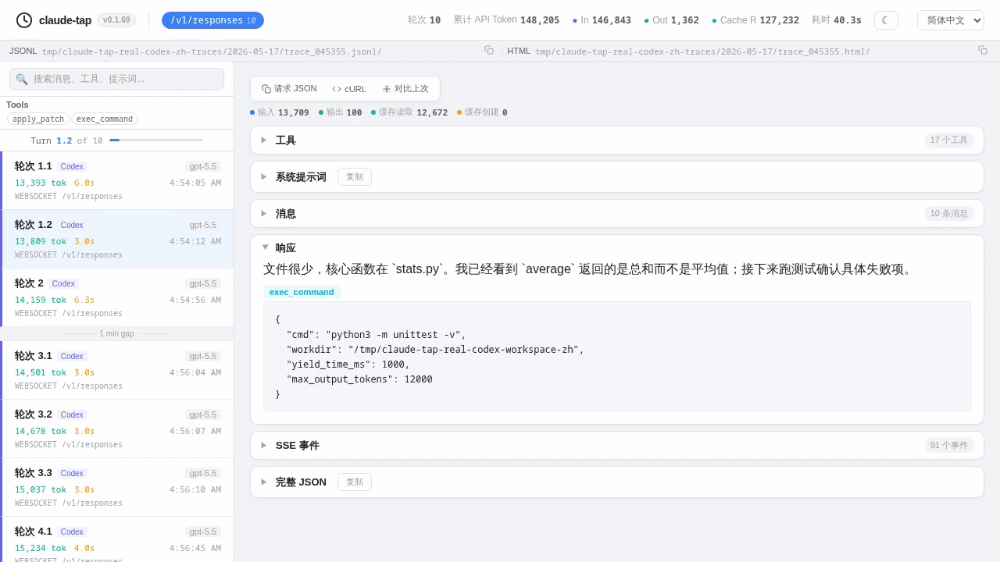
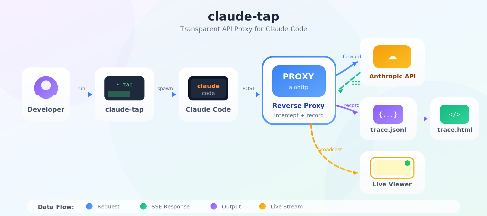
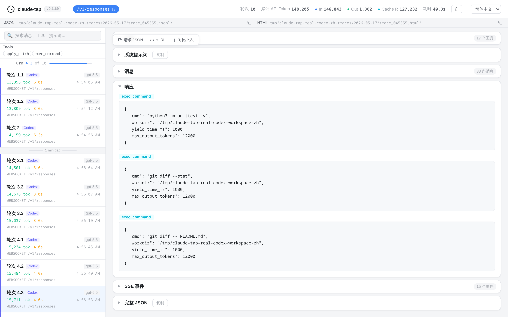
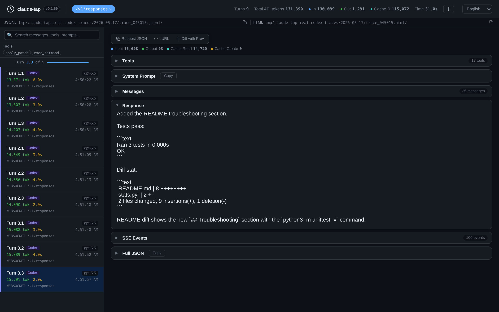
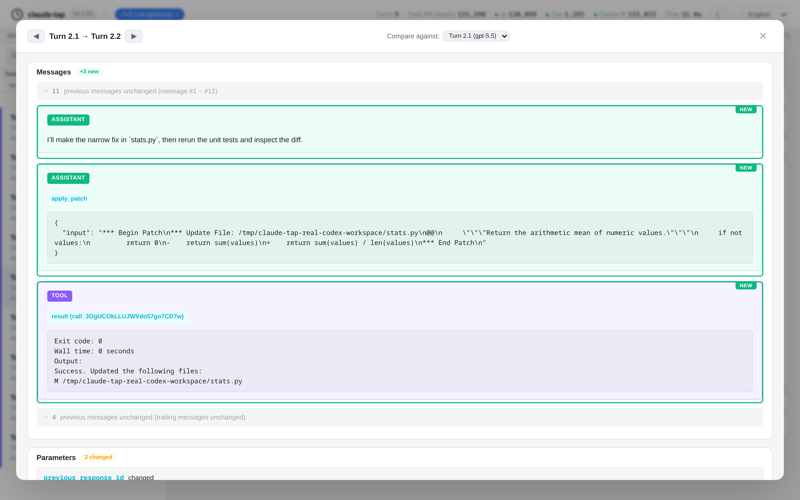

# claude-tap-go

[English](README.en.md)

`claude-tap-go` 是一个用 Go 实现的本地 AI CLI API trace 代理与查看器。它会把 AI 编程 CLI 的请求转发到本地代理，记录真实 API 请求/响应，并通过本地网页实时查看 prompt、messages、tool schema、tool call、流式响应、token 用量和请求差异。

本项目是 [claude-tap](https://github.com/liaohch3/claude-tap) 的 Go 移植/实验版本。最初动机很简单：我在 Windows 环境使用原版 `claude-tap` 时遇到了兼容性问题，无法稳定使用，所以尝试改用 Go 实现一版更贴近 Windows 的工具。

## 当前状态

请先阅读这一段，避免误会项目成熟度：

- 目前只在 Windows 开发环境中开发和测试。
- 目前只实际测试过 Claude Code。
- Linux / macOS 暂未测试。
- 代码中保留了对 Codex、Gemini、Kimi、OpenCode、Hermes、Cursor、Pi、Qoder、Antigravity 等客户端的配置，但这些客户端我还没有逐一验证。
- 如果你在其他系统或其他客户端上遇到问题，或者有明确需求，欢迎提 Issue。

## 演示

以下演示图来自原 `claude-tap` 项目，Go 版沿用相近的 trace 与查看器思路，实际界面可能会随 Go 版实现略有差异。

<p align="center">
  
  <br>
  <sub>查看一次真实 agent 运行，逐条检查 API 请求，并观察上下文如何变化。</sub>
</p>

<p align="center">
  
  <br>
  <sub>整体流程：启动本地代理，注入 CLI 环境变量，记录 JSONL trace，并生成本地查看器。</sub>
</p>

<table>
  <tr>
    <td width="33%" align="center">
      
      <br>
      <sub>Trace 查看器概览</sub>
    </td>
    <td width="33%" align="center">
      
      <br>
      <sub>深色模式</sub>
    </td>
    <td width="33%" align="center">
      
      <br>
      <sub>相邻请求结构化 Diff</sub>
    </td>
  </tr>
</table>

## 为什么需要它

- 看见真实上下文：检查 system prompt、messages、工具定义、工具调用、工具结果、流式 chunk 和 token 用量。
- 用证据定位问题：对比相邻请求，确认是哪段 prompt、消息、工具或参数发生了变化。
- 留下可分享的本地证据：每次运行写入 JSONL trace，并生成自包含 HTML 查看器。
- 数据留在本机：不依赖云端 dashboard，常见认证 header 会在记录前脱敏。
- 更适合 Windows 使用：Go 版的主要目标是解决我在 Windows 上遇到的使用兼容性问题。

## 安装与构建

需要 Go 1.22 或更新版本。

```powershell
git clone https://github.com/wywang792/claude-tap-go.git
cd claude-tap-go
go build -o claude-tap.exe ./cmd/claude-tap
```

也可以直接运行：

```powershell
go run ./cmd/claude-tap
```

## 快速开始

默认启动 Claude Code，并打开实时查看器：

```powershell
.\claude-tap.exe
```

只启动代理，不自动启动客户端：

```powershell
.\claude-tap.exe --tap-no-launch --tap-port 18080
```

关闭实时查看器：

```powershell
.\claude-tap.exe --tap-no-live
```

向 Claude Code 透传参数：

```powershell
.\claude-tap.exe -- --model claude-sonnet-4-6
.\claude-tap.exe -- --dangerously-skip-permissions
```

打开历史会话 dashboard：

```powershell
.\claude-tap.exe dashboard --tap-live-port 8989
```

导出 trace：

```powershell
.\claude-tap.exe export .traces/2026-05-22/trace_120000.jsonl -o report.md
.\claude-tap.exe export .traces/2026-05-22/trace_120000.jsonl --format json -o report.json
```

## 其他客户端

代码中提供了以下客户端配置：

```powershell
.\claude-tap.exe --tap-client codex
.\claude-tap.exe --tap-client kimi
.\claude-tap.exe --tap-client gemini
.\claude-tap.exe --tap-client opencode
.\claude-tap.exe --tap-client hermes
.\claude-tap.exe --tap-client cursor
.\claude-tap.exe --tap-client pi
.\claude-tap.exe --tap-client qoder
.\claude-tap.exe --tap-client agy
```

但再次说明：这些客户端目前还没有在我的环境里完成实际验证。如果你正在使用其中某个客户端，并愿意补充测试结果或修复，非常欢迎提 Issue / PR。

## 常用参数

| 参数 | 默认值 | 说明 |
| --- | --- | --- |
| `--tap-client` | `claude` | 要启动的客户端 |
| `--tap-proxy-mode` | 按客户端配置 | `reverse` 或 `forward` |
| `--tap-target` | 自动识别 | 上游 API base URL |
| `--tap-port` | `0` | 代理端口，`0` 表示自动选择 |
| `--tap-host` | `127.0.0.1` | 代理和查看器绑定地址 |
| `--tap-live` | `true` | 启用实时查看器 |
| `--tap-no-live` | `false` | 禁用实时查看器 |
| `--tap-live-port` | `0` | 实时查看器端口，`0` 表示自动选择 |
| `--tap-no-open` | `false` | 不自动打开浏览器 |
| `--tap-no-launch` | `false` | 只启动代理，不启动客户端 |
| `--tap-output-dir` | `.traces` | trace 输出目录 |
| `--tap-max-traces` | `50` | 最多保留的 trace 会话数，`0` 表示不清理 |
| `--tap-console-log` | `false` | 将代理日志同步输出到 stderr |
| `--tap-allow-path` | 空 | 额外允许的 reverse proxy path 前缀，逗号分隔 |

## 输出文件

默认输出到 `.traces/`：

```text
.traces/
  .cloudtap-manifest.json
  2026-05-22/
    trace_120000.jsonl
    trace_120000.log
    trace_120000.html
```

trace 可能包含 prompt、模型响应、工具参数、本地文件路径、请求体和响应体。虽然常见认证 header 会被脱敏，但 `.traces/` 仍应视为敏感数据，不要提交到公开仓库。

## 已知限制

- 目前只在 Windows + Claude Code 上测试过。
- `trust-ca` 会生成并打印 CA 证书路径，但不会自动安装到系统信任区。
- `update` 子命令目前只是占位。
- forward proxy 下的 WebSocket-over-CONNECT 记录能力有限，主要支持普通 HTTP/HTTPS API 请求。

## 开发

```powershell
go test ./...
go vet ./...
go build ./cmd/claude-tap
```

如果默认 Go cache 目录不可写，可以使用项目内缓存：

```powershell
$env:GOCACHE="$PWD\.gocache"
$env:GOMODCACHE="$PWD\.gomodcache"
go test ./...
```

## 致谢

感谢原项目 [claude-tap](https://github.com/liaohch3/claude-tap)。本项目的思路、查看器体验和部分说明材料来自原项目。

## License

MIT. See [LICENSE](LICENSE) and [NOTICE](NOTICE).
